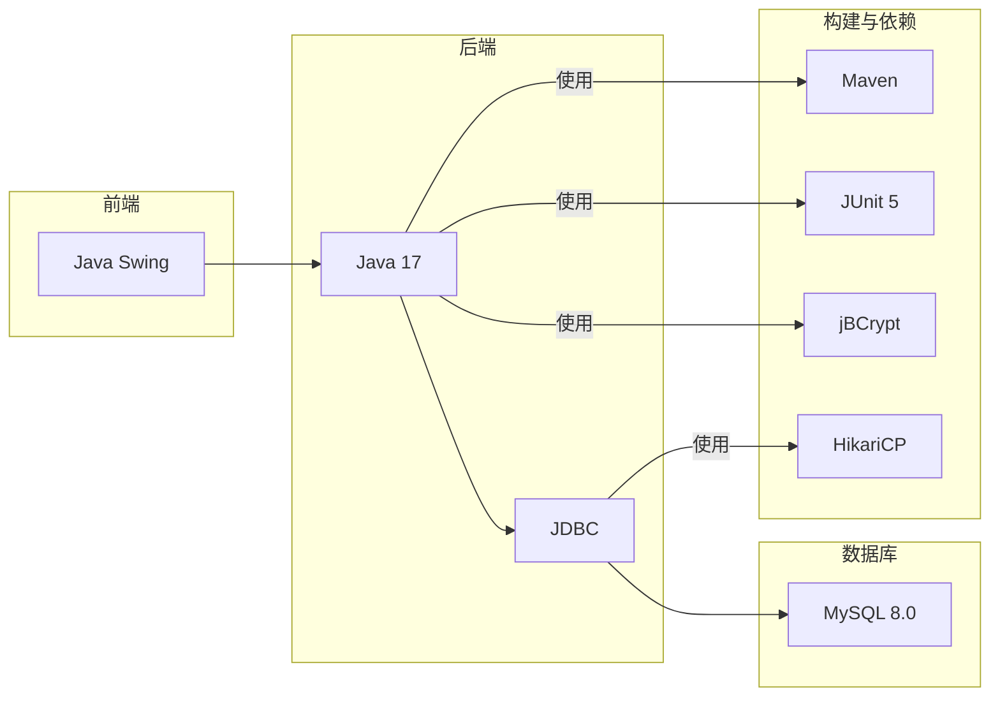
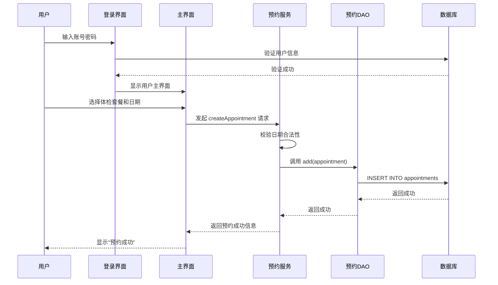
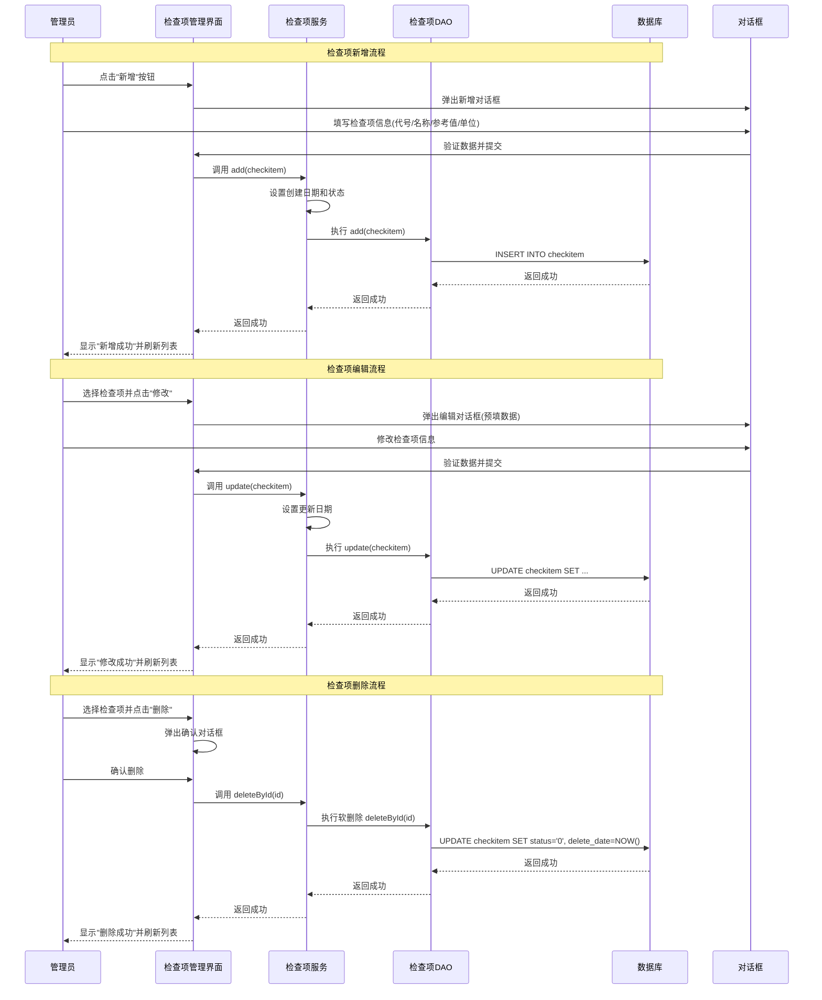
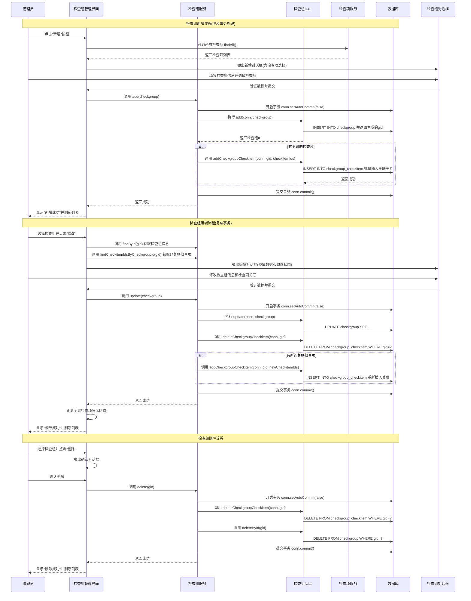

# 传智健康项目PPT内容规划

## Slide 1: 封面页
- **项目名称**: 传智健康管理系统
- **项目简介**: 一个基于Java Swing的桌面健康管理平台
- **汇报人**: 黎同学
- **汇报日期**: 2025/07/03

## Slide 2: 项目背景与目标
- **背景**: 传统医疗模式向主动健康预防转型，个人健康管理需求日益增长。
- **目标**:
    - 为用户提供便捷的数字化健康管理服务，包括体检预约、报告查询、健康跟踪。
    - 为医护人员提供高效的数据管理工具，优化工作流程。
    - 锻炼并检验独立进行软件项目全周期开发的能力。

## Slide 3: 核心功能介绍
- **用户端核心功能**:
    - 用户注册与登录
    - 体检套餐预约
    - 个人体检报告查询
    - 历史体检数据对比与跟踪
- **管理端核心功能**:
    - **检查项管理**: 增、删、改、查单个检查项目。
    - **检查组管理**: 组合检查项为体检套餐，并进行管理。
    - **用户权限管理**: 区分管理员与普通用户角色。

## Slide 4: 系统整体架构
- **标题**: 系统分层架构设计
- **描述**: 系统采用经典的三层架构模式，实现了表现层、业务逻辑层和数据访问层的分离，保证了系统的高内聚和低耦合。
- **图表代码**:
```mermaid
graph TD
    subgraph 表现层 (View)
        A[登录/注册界面]
        B[管理员操作界面]
        C[用户操作界面]
    end
    subgraph 业务逻辑层 (Service)
        D[UserService]
        E[AppointmentService]
        F[CheckitemService]
        G[CheckgroupService]
    end
    subgraph 数据访问层 (DAO)
        H[UserDao]
        I[AppointmentDao]
        J[CheckitemDao]
        K[CheckgroupDao]
    end
    subgraph 数据层 (Database)
        L[(MySQL 数据库)]
    end

    A & B & C --> D & E & F & G
    D & E & F & G --> H & I & J & K
    H & I & J & K --> L
```

## Slide 5: 技术栈与工具
- **标题**: 项目技术栈概览
- **描述**: 本项目选用成熟、稳定的Java技术生态，确保了开发的可靠性与效率。
- **图表代码**:


## Slide 6: 核心业务流程 - 用户预约
- **标题**: 用户体检预约流程
- **描述**: 展示了普通用户从登录到成功预约体检的核心操作路径。
- **图表代码**:


## Slide 6.1: 管理员检查项管理流程
- **标题**: 管理员检查项管理操作流程
- **描述**: 展示了管理员在检查项管理界面进行增删改查操作的完整流程。
- **图表代码**:


## Slide 6.2: 管理员检查组管理流程
- **标题**: 管理员检查组管理操作流程  
- **描述**: 展示了管理员在检查组管理界面进行复杂的多表关联操作流程，包括检查组与检查项的关联管理。
- **图表代码**:


## Slide 7: 数据库设计
- **核心表**:
    - `users`: 存储用户信息
    - `checkitem`: 存储检查项
    - `checkgroup`: 存储检查组（套餐）
    - `appointments`: 存储用户预约记录
    - `exam_results`: 存储体检结果
- **关系**:
    - 用户与角色 (多对多)
    - 检查组与检查项 (多对多)
    - 用户与预约 (一对多)

## Slide 8: 项目亮点与难点
- **亮点**:
    - **分层架构**: 清晰的架构设计，易于维护和扩展。
    - **角色权限**: 实现了管理员和普通用户的权限隔离。
    - **数据驱动**: 核心业务逻辑均通过数据库驱动，保证数据一致性。
- **难点**:
    - **Swing界面设计**: 需要手动布局和管理组件，较为繁琐。
    - **多表关联查询**: 在检查组和预约查询中，需要正确处理复杂的SQL关联查询。
    - **独立开发**: 从需求到测试的全流程独立完成，对综合能力要求高。

## Slide 9: 总结与展望
- **总结**:
    - 成功完成了传智健康管理系统的核心功能开发。
    - 掌握了Java Swing桌面应用开发的全过程。
    - 深入理解了分层架构和数据库设计的重要性。
- **展望**:
    - **功能扩展**: 增加在线支付、健康资讯推送等功能。
    - **技术升级**: 考虑将项目重构为Web应用（如Spring Boot + Vue），提供更广泛的访问性。
    - **性能优化**: 对高频查询增加缓存机制。
- **致谢**: 感谢老师的指导！