### **传智健康管理系统 - 健壮性与负面测试清单**

#### **1. 无效输入测试**

*   **所有文本输入框**
    *   [ ] 在所有文本输入框中尝试输入空值。
    *   [ ] 在所有文本输入框中尝试输入超长字符串（例如，超过数据库字段定义的最大长度）。
    *   [ ] 在所有文本输入框中尝试输入特殊字符（如 `!@#$%^&*()_+-=[]{}|\;:'",.<>/?`）。
    *   [ ] 在所有文本输入框中尝试输入 SQL 注入代码（例如 `' OR '1'='1' --`）。
    *   [ ] 在所有文本输入框中尝试输入跨站脚本 (XSS) 代码（例如 ``）。

*   **特定输入框**
    *   **用户名/账号 (`username`)**:
        *   [ ] 输入包含空格的用户名。
        *   [ ] 输入非法的用户名格式（例如，包含不允许的字符）。
    *   **密码 (`password`)**:
        *   [ ] 输入空密码。
        *   [ ] 输入超长密码。
        *   [ ] 输入弱密码（如果系统有密码强度要求）。
    *   **姓名 (`uname`)**:
        *   [ ] 输入包含数字或特殊字符的姓名。
    *   **电话 (`tel`)**:
        *   [ ] 输入非11位数字的电话号码。
        *   [ ] 输入包含字母或特殊字符的电话号码。
    *   **身份证 (`idcard`)**:
        *   [ ] 输入非18位数字或包含非法字符的身份证号码。
        *   [ ] 输入不符合身份证校验规则的号码。
    *   **检查项代号 (`ccode`) / 检查组代号 (`gcode`)**:
        *   [ ] 输入空代号。
        *   [ ] 输入已存在的代号（对于新增操作）。
    *   **检查项名称 (`cname`) / 检查组名称 (`gname`)**:
        *   [ ] 输入空名称。
        *   [ ] 输入超长名称。
    *   **参考值 (`refer_val`)**:
        *   [ ] 输入非数字或非法格式的参考值。
    *   **单位 (`unit`)**:
        *   [ ] 输入空单位。
        *   [ ] 输入超长单位。

#### **2. 边界条件测试**

*   **数字输入框**
    *   [ ] 在需要数字的地方输入字母或非数字字符。
    *   [ ] 在年龄、数量等数字输入框中输入最小值（例如，0或负数，如果业务逻辑不允许）。
    *   [ ] 在年龄、数量等数字输入框中输入最大值（例如，超过 `INT` 或 `BIGINT` 范围的值）。
    *   [ ] 在年龄、数量等数字输入框中输入零（如果业务逻辑不允许）。
    *   [ ] 在数字输入框中输入小数（如果只允许整数）。

*   **日期/时间选择器**
    *   [ ] 在日期选择器中选择一个过去的时间点进行预约。
    *   [ ] 在日期选择器中选择一个非常遥远的未来时间点进行预约。
    *   [ ] 选择无效日期（例如，2月30日）。
    *   [ ] 选择系统不支持的日期格式。

#### **3. 业务逻辑冲突测试**

*   **删除操作**
    *   [ ] 尝试删除一个已被检查组使用的检查项。
    *   [ ] 尝试删除一个已被预约使用的检查组。
    *   [ ] 尝试删除一个已被预约使用的用户。

*   **新增/修改操作**
    *   [ ] 尝试注册一个已存在的用户名。
    *   [ ] 尝试新增一个已存在的检查项代号。
    *   [ ] 尝试新增一个已存在的检查组代号。
    *   [ ] 尝试修改检查项/检查组时，将其代号修改为已存在的代号。
    *   [ ] 尝试预约一个已满的日期或时间段（如果系统支持预约容量限制）。
    *   [ ] 尝试预约时，选择一个不存在的检查组。

*   **权限相关**
    *   [ ] 普通用户尝试访问管理员功能模块（如检查项管理、检查组管理）。
    *   [ ] 管理员尝试执行普通用户无法执行的特定操作（如果存在）。

#### **4. 用户操作异常测试**

*   **界面操作**
    *   [ ] 在表格中未选择任何行的情况下点击“修改”按钮。
    *   [ ] 在表格中未选择任何行的情况下点击“删除”按钮。
    *   [ ] 在需要确认的对话框中点击“取消”按钮。
    *   [ ] 连续快速点击某个按钮（例如，提交按钮），测试重复提交。
    *   [ ] 在数据加载过程中进行其他操作。
    *   [ ] 在输入框中输入内容后，不点击保存或提交，直接关闭窗口。

*   **网络与系统异常**
    *   [ ] 在网络连接中断时尝试进行数据库操作（如登录、注册、增删改查）。
    *   [ ] 在数据库连接中断时尝试进行任何操作。
    *   [ ] 在系统资源不足（如内存不足）时进行操作。
    *   [ ] 模拟服务器响应超时。

*   **数据一致性**
    *   [ ] 在多用户并发操作同一数据时，检查数据一致性（例如，两个管理员同时修改同一个检查项）。

### **Mermaid 图示（测试分类与覆盖）**

```mermaid
graph TD
    A[健壮性与负面测试清单] --> B(无效输入测试)
    A --> C(边界条件测试)
    A --> D(业务逻辑冲突测试)
    A --> E(用户操作异常测试)

    B --> B1[所有文本输入框]
    B1 --> B1_1[空值]
    B1 --> B1_2[超长字符串]
    B1 --> B1_3[特殊字符]
    B1 --> B1_4[SQL 注入]
    B1 --> B1_5[XSS 注入]
    B --> B2[特定输入框]
    B2 --> B2_1[用户名/密码]
    B2 --> B2_2[姓名/电话/身份证]
    B2 --> B2_3[代号/名称]
    B2 --> B2_4[参考值/单位]

    C --> C1[数字输入框]
    C1 --> C1_1[非数字字符]
    C1 --> C1_2[最小值/最大值]
    C1 --> C1_3[零]
    C1 --> C1_4[小数]
    C --> C2[日期/时间选择器]
    C2 --> C2_1[过去时间]
    C2 --> C2_2[遥远未来时间]
    C2 --> C2_3[无效日期]
    C2 --> C2_4[不支持格式]

    D --> D1[删除操作]
    D1 --> D1_1[删除已使用检查项]
    D1 --> D1_2[删除已使用检查组]
    D1 --> D1_3[删除已使用用户]
    D --> D2[新增/修改操作]
    D2 --> D2_1[注册已存在用户名]
    D2 --> D2_2[新增/修改已存在代号]
    D2 --> D2_3[预约已满/不存在检查组]
    D --> D3[权限相关]
    D3 --> D3_1[普通用户访问管理员功能]

    E --> E1[界面操作]
    E1 --> E1_1[未选择行点击修改/删除]
    E1 --> E1_2[取消确认对话框]
    E1 --> E1_3[快速点击/重复提交]
    E1 --> E1_4[数据加载中操作]
    E1 --> E1_5[直接关闭窗口]
    E --> E2[网络与系统异常]
    E2 --> E2_1[网络中断]
    E2 --> E2_2[数据库中断]
    E2 --> E2_3[系统资源不足]
    E2 --> E2_4[服务器超时]
    E --> E3[数据一致性]
    E3 --> E3_1[并发操作]
```

<line_count>189</line_count>
</write_to_file>